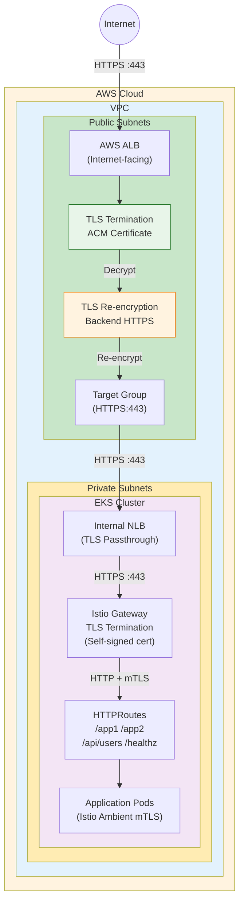
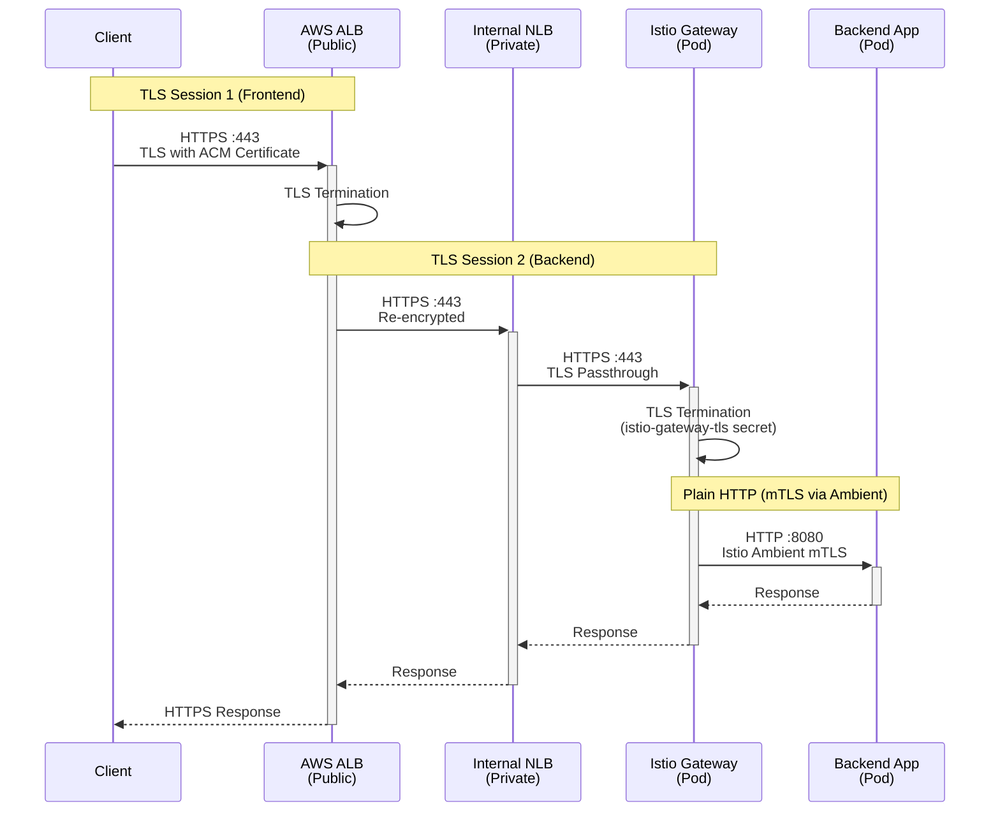
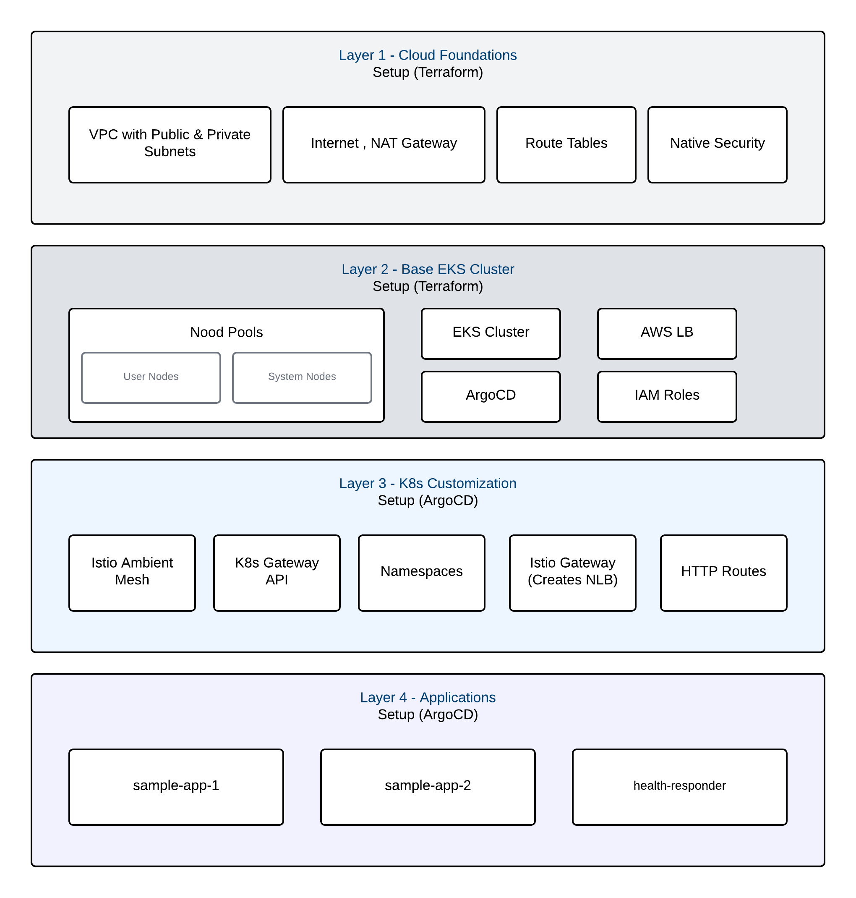
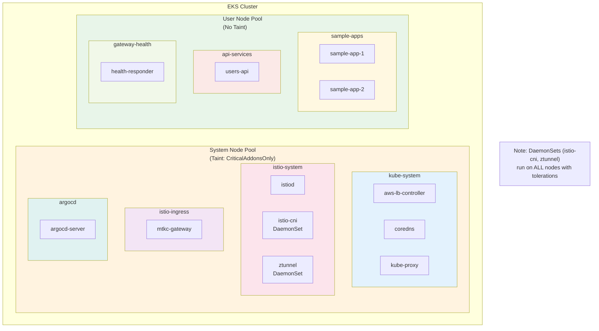
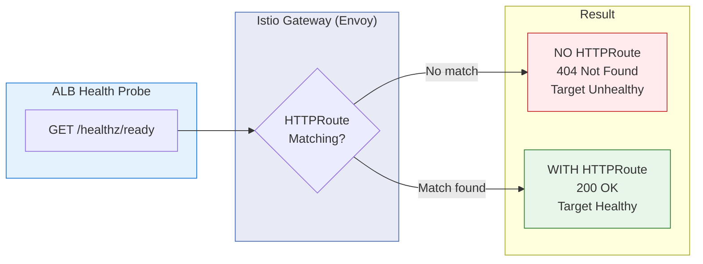

# POC - AWS EKS with Kubernetes Gateway API & Istio Ambient

**Author:** Shanaka Jayasundera - shanakaj@gmail.com

This project demonstrates a modern Kubernetes architecture on AWS EKS using:
- **Kubernetes Gateway API** (not Ingress)
- **Istio Ambient Mesh** (no sidecars)
- **End-to-End TLS** with self-signed certificates
- **AWS ALB** (external) + **Internal NLB** for web traffic
- **ArgoCD** for GitOps deployments

## Architecture Overview



**Traffic Flow:** `Internet` → `ALB (TLS Terminate + Re-encrypt)` → `Internal NLB (Passthrough)` → `Istio Gateway (TLS Terminate)` → `Apps (mTLS)`

### ALB SSL Termination & Re-encryption (Similar to Azure App Gateway)

AWS ALB supports **end-to-end TLS** with the same pattern as Azure Application Gateway:

| Feature | AWS ALB | Azure App Gateway |
|---------|---------|-------------------|
| **Frontend TLS Termination** | Yes (ACM Certificate) | Yes (Key Vault/PFX) |
| **Backend Re-encryption** | Yes (HTTPS Target Group) | Yes (Backend HTTPS) |
| **Backend Certificate Validation** | Optional (can skip for self-signed) | Optional |
| **Health Check over HTTPS** | Yes | Yes |

**How it works:**
1. **Client → ALB**: TLS terminated using ACM certificate (trusted CA)
2. **ALB → Backend**: Re-encrypted using HTTPS Target Group (self-signed cert OK)
3. **NLB**: Pure L4 passthrough - no TLS inspection
4. **Istio Gateway**: Second TLS termination using `istio-gateway-tls` secret
5. **Gateway → Pods**: Plain HTTP, but Istio Ambient adds transparent mTLS

## End-to-End Traffic Flow

The architecture implements **dual TLS termination** for secure traffic from client to backend:



### TLS Certificate Chain

| Component | Certificate | Purpose |
|-----------|-------------|---------|
| **ALB Frontend** | ACM Certificate | Terminates client HTTPS, provides trusted certificate |
| **Istio Gateway** | `istio-gateway-tls` Secret | Terminates re-encrypted traffic from ALB via NLB |
| **Pod-to-Pod** | Istio Ambient mTLS | Automatic mTLS between services (no sidecar needed) |

### Certificate Configuration

**1. ALB Frontend (ACM Certificate)**
- Use AWS Certificate Manager (ACM) for the public-facing certificate
- Set `enable_https = true` and `acm_certificate_arn` in Terraform variables

**2. Istio Gateway Backend (Self-signed)**
```bash
# Generate certificates
./scripts/01-generate-certs.sh

# Create Kubernetes secret
kubectl create namespace istio-ingress
kubectl create secret tls istio-gateway-tls \
  --cert=certs/server.crt \
  --key=certs/server.key \
  -n istio-ingress
```

**3. Enable End-to-End TLS in Terraform**
```hcl
# terraform.tfvars
enable_https          = true
acm_certificate_arn   = "arn:aws:acm:region:account:certificate/xxx"
backend_https_enabled = true  # ALB -> NLB -> Gateway over HTTPS
```

## Architecture Layers



## Layer Responsibilities

| Layer | Tool | What It Creates |
|-------|------|-----------------|
| **Layer 1** | Terraform | VPC, Subnets (Public/Private), NAT/IGW, Route Tables |
| **Layer 2** | Terraform | EKS, Node Groups (System/User), IAM, ArgoCD, LB Controller, ALB |
| **Layer 3** | ArgoCD | Gateway API CRDs, Istio Ambient, Gateway, HTTPRoutes |
| **Layer 4** | ArgoCD | Applications (app1, app2, users-api, health-responder) |

## EKS Cluster Detail



## Prerequisites

- AWS CLI configured with appropriate credentials
- Terraform >= 1.0
- kubectl
- Helm 3
- jq and dig (for post-deployment script)

## Deployment Steps

### Step 1: Deploy Infrastructure (Layers 1 & 2)

```bash
cd terraform

# Review and customize variables
cp terraform.tfvars.example terraform.tfvars
# Edit terraform.tfvars as needed

# Initialize and apply
terraform init
terraform apply
```

This creates:
- **Layer 1:** VPC, subnets, NAT gateway
- **Layer 2:** EKS cluster, ArgoCD, AWS LB Controller, ALB

### Step 2: Configure kubectl

```bash
# Get credentials
$(terraform output -raw eks_get_credentials_command)
```

### Step 3: Generate TLS Certificates

```bash
./scripts/01-generate-certs.sh
```

### Step 4: Create TLS Secret

```bash
kubectl create namespace istio-ingress
kubectl create secret tls istio-gateway-tls \
  --cert=certs/server.crt \
  --key=certs/server.key \
  -n istio-ingress
```

### Step 5: Deploy ArgoCD Root App (Layers 3 & 4)

```bash
# Get ArgoCD admin password
terraform output -raw argocd_admin_password

# Apply root application
kubectl apply -f argocd/root-app.yaml

# Wait for all apps to sync
kubectl get applications -n argocd -w
```

This deploys via ArgoCD:
- **Layer 3:** Gateway API CRDs, Istio Ambient, Gateway, HTTPRoutes
- **Layer 4:** Sample apps

### Step 6: Register NLB with ALB Target Group

```bash
./scripts/06-register-nlb-with-alb.sh
```

> **Why is this step needed?**
>
> The Istio Gateway (via Gateway API) creates an Internal NLB dynamically using the AWS Load Balancer Controller. This happens **after** Terraform completes, when ArgoCD syncs the Gateway resource. Since Terraform doesn't know about this dynamically-created NLB, we need a post-deployment step to:
>
> 1. Wait for the Gateway to be ready
> 2. Discover the NLB IP address
> 3. Register it with the ALB target group
>
> ```
> ┌──────────────┐     ┌──────────────┐     ┌──────────────┐
> │  Terraform   │     │   ArgoCD     │     │ Post-Deploy  │
> │  (Layers 1-2)│────▶│  (Layers 3-4)│────▶│   Script     │
> │              │     │              │     │              │
> │ Creates ALB  │     │ Creates NLB  │     │ Registers    │
> │ + Target Grp │     │ via Gateway  │     │ NLB → ALB    │
> └──────────────┘     └──────────────┘     └──────────────┘
> ```
>
> **Alternative Approach:**
>
> To fully automate this in Terraform, you could modify the Gateway to use `ClusterIP` instead of `LoadBalancer`, then create the NLB Service in Terraform:
>
> ```yaml
> # Gateway with ClusterIP (no auto-created LoadBalancer)
> apiVersion: gateway.networking.k8s.io/v1
> kind: Gateway
> metadata:
>   annotations:
>     networking.istio.io/service-type: ClusterIP  # Prevents NLB creation
> ```
>
> Then Terraform creates a separate Service pointing to the Gateway pods, giving full control over the NLB lifecycle. See the commented alternative in `k8s/istio/gateway.yaml` for details.

## Project Structure

```
EKS-Istio-GatewayAPI-Demo/
├── terraform/                    # LAYERS 1 & 2
│   ├── main.tf                   # Root module with layer comments
│   ├── variables.tf
│   ├── outputs.tf
│   ├── providers.tf
│   └── modules/
│       ├── vpc/                  # Layer 1: Cloud Foundations
│       ├── eks/                  # Layer 2: EKS Cluster
│       ├── iam/                  # Layer 2: IAM Roles
│       ├── alb/                  # Layer 2: Application Load Balancer
│       ├── argocd/               # Layer 2: ArgoCD Installation
│       └── lb-controller/        # Layer 2: AWS LB Controller
├── argocd/                       # LAYERS 3 & 4
│   ├── root-app.yaml             # Root application (App of Apps)
│   └── apps/
│       ├── 00-gateway-api-crds.yaml  # Layer 3: Gateway API CRDs
│       ├── 01-namespaces.yaml        # Layer 3
│       ├── 02-istio-base.yaml        # Layer 3
│       ├── 03-istiod.yaml            # Layer 3
│       ├── 04-istio-cni.yaml         # Layer 3
│       ├── 05-ztunnel.yaml           # Layer 3
│       ├── 06-gateway.yaml           # Layer 3
│       ├── 07-httproutes.yaml        # Layer 3
│       └── 08-apps.yaml              # Layer 4
├── k8s/
│   ├── namespace.yaml            # Ambient-enabled namespaces
│   ├── apps/                     # Layer 4: Sample applications
│   └── istio/                    # Layer 3: Gateway & HTTPRoutes
├── certs/
└── scripts/
    ├── 01-generate-certs.sh      # Generate TLS certificates
    └── 06-register-nlb-with-alb.sh  # Register NLB with ALB (post-deploy)
```

## Key Terraform Variables

| Variable | Default | Description |
|----------|---------|-------------|
| `region` | ap-southeast-2 | AWS region |
| `kubernetes_version` | 1.34 | EKS Kubernetes version |
| `eks_node_count` | 2 | Number of system nodes |
| `enable_user_node_pool` | true | Enable separate user node pool |
| `argocd_version` | 5.51.6 | ArgoCD Helm chart version |
| `argocd_service_type` | ClusterIP | ArgoCD server service type |
| `enable_https` | false | Enable HTTPS on ALB (requires ACM cert) |

## Key Terraform Outputs

| Output | Description |
|--------|-------------|
| `eks_cluster_name` | EKS cluster name |
| `alb_dns_name` | ALB DNS name for testing |
| `argocd_admin_password` | ArgoCD admin password |
| `argocd_port_forward_command` | Command to access ArgoCD UI |
| `register_nlb_command` | Post-deployment script path |

## Verification

### Test Web Endpoints (via ALB)

```bash
ALB_DNS=$(terraform -chdir=terraform output -raw alb_dns_name)

curl http://${ALB_DNS}/healthz/ready
curl http://${ALB_DNS}/app1
curl http://${ALB_DNS}/app2
curl http://${ALB_DNS}/api/users
```

### Access ArgoCD UI

```bash
# Port forward to ArgoCD
kubectl port-forward svc/argocd-server -n argocd 8080:443

# Open https://localhost:8080
# Username: admin
# Password: terraform output -raw argocd_admin_password
```

### Check ArgoCD Apps

```bash
kubectl get applications -n argocd
```

Expected output:
```
NAME                SYNC STATUS   HEALTH STATUS
gateway-api-crds    Synced        Healthy
istio-base          Synced        Healthy
istio-cni           Synced        Healthy
istiod              Synced        Healthy
ztunnel             Synced        Healthy
namespaces          Synced        Healthy
gateway             Synced        Healthy
httproutes          Synced        Healthy
sample-apps         Synced        Healthy
```

## Cleanup

```bash
# Delete ArgoCD apps first
kubectl delete -f argocd/root-app.yaml

# Wait for resources to be cleaned up
sleep 60

# Destroy infrastructure
cd terraform
terraform destroy
```

## Troubleshooting

### ArgoCD not accessible
```bash
kubectl get pods -n argocd
kubectl port-forward svc/argocd-server -n argocd 8080:443
```

### Gateway not creating NLB
```bash
# Check Gateway status
kubectl get gateway -n istio-ingress -o yaml

# Check AWS LB Controller logs
kubectl logs -n kube-system -l app.kubernetes.io/name=aws-load-balancer-controller
```

### NLB registration script fails
```bash
# Check if Gateway is ready
kubectl get gateway -n istio-ingress mtkc-gateway

# Manually get NLB hostname
kubectl get gateway -n istio-ingress mtkc-gateway -o jsonpath='{.status.addresses[0].value}'
```

### Pods not scheduling on correct nodes
```bash
# Check node labels
kubectl get nodes --show-labels | grep role

# Check taints
kubectl describe nodes | grep -A5 Taints
```

---

> **Note:** This is a POC demonstrating how Kubernetes Gateway API can be implemented on AWS EKS with Istio Ambient Mesh. For a more complete production-ready reference architecture including CloudFront, WAF, S3 static assets, and AWS API Gateway, see the [`reference-architecture`](https://github.com/shanaka-versent/EKS-Istio-GatewayAPI-Deom/tree/reference-architecture) branch.

---

## Appendix: Cloud Provider Comparison

This project demonstrates AWS EKS implementation. The following table shows equivalent components for Azure AKS:

| Component | Azure (AKS) | AWS (EKS) |
|-----------|-------------|-----------|
| External L7 LB | Azure App Gateway | AWS ALB |
| Internal L4 LB | Azure Internal LB | AWS Internal NLB |
| LB Controller | cloud-controller-manager | AWS Load Balancer Controller |
| Service Mesh | Istio Gateway | Istio Gateway |
| Gateway API | Same (Kubernetes standard) | Same (Kubernetes standard) |
| GitOps | ArgoCD | ArgoCD |

### Critical Fixes: AKS vs EKS

The [AKS Istio Gateway API implementation](https://github.com/shanaka-versent/AKS-Istio-GatewayAPI-Demo) required two critical fixes. Here's how they apply to EKS:

| Fix | Description | AKS | EKS |
|-----|-------------|-----|-----|
| **Health Probe HTTPRoute** | Route `/healthz/*` to a health-responder service so ALB/App Gateway health probes succeed | Required | Required (implemented) |
| **externalTrafficPolicy: Local** | Prevent SNAT on Internal LB to fix Azure DSR/Floating IP routing | Required | Not required |

**Why Fix 2 is not needed for EKS:**
- Azure App Gateway with Internal LB uses Direct Server Return (DSR) with Floating IP, which requires `externalTrafficPolicy: Local` to prevent SNAT from breaking the return path
- AWS NLB with IP target type uses VPC routing directly to pod IPs, avoiding the SNAT issue entirely

### Fix 1: HTTPRoute for /healthz (Health Probe Routing)

**Problem:** ALB health probes to `/healthz/ready` return 404 errors because the Istio Gateway has no routing rule defined for health check requests.

**Solution:** A dedicated HTTPRoute routes `/healthz/*` paths to a health-responder service that returns 200 OK responses.



**Implementation Files:**
| File | Purpose |
|------|---------|
| [k8s/istio/httproutes.yaml](k8s/istio/httproutes.yaml) | Defines health-route for `/healthz/*` paths |
| [k8s/apps/health-responder.yaml](k8s/apps/health-responder.yaml) | Deploys nginx pod responding with 200 OK |
| [k8s/istio/httproutes.yaml](k8s/istio/httproutes.yaml) | ReferenceGrant for cross-namespace routing |

## License

MIT License
